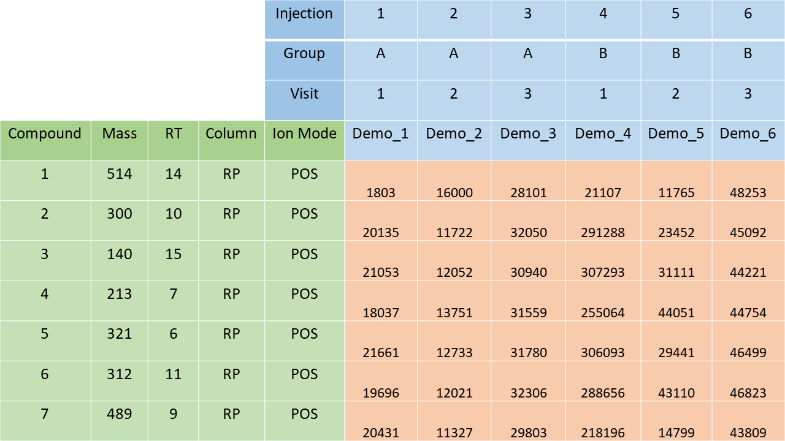

# Non-targeted metabolomics preprocessing and data wrangling

## Motivation

From the perspective of metabolites as the continuation of the central
dogma of biology, metabolomics provides the closest link to many
phenotypes of interest. This makes metabolomics research promising in
teasing apart the complexities of living systems, attracting many new
practitioners.

The notame R package was developed in parallel with a protocol article
as a general guideline for data analysis in untargeted metabolomics
studies (Klåvus et al. 2020). The notame package was split into notame,
notameViz and notameStats for Bioconductor. The primary goal is
identifying quality, interesting features for laborious downstream steps
relating to biological context, such as metabolite identification and
pathway analysis. Bioconductor packages with complementary functionality
in Bioconductor include pmp, phenomis and qmtools; notame packages
brings partially overlapping and new functionality to the table. There
are also Bioconductor packages for preprocessing, metabolite
identification and pathway analysis. Together, notame, Bioconductor’s
dependency management and other Bioconductor functionality allow for
quality, reproducible metabolomics research. Please see the [notame
website](https://%20hanhineva-lab.github.io/notame/) and protocol
article for more information (Klåvus et al. 2020).

## Installation

To install notame, install BiocManager first, if it is not installed.
Afterwards use the install function from BiocManager.

``` r

if (!requireNamespace("BiocManager", quietly = TRUE))
    install.packages("BiocManager")
BiocManager::install("notame")
library(notame)
```

### Drift correction

Untargeted LC-MS metabolomics data usually suffers from signal intensity
drift, i.e. systematic variation in the signal intensity as a function
of injection order. Features of a dataset often have very different
drift patterns. This means that to correct for the drift, we need a tool
that can adapt to different drift patterns.

The approach used in this package models the drift separately for each
feature, using pooled QC samples and cubic spline regression. The
smoothing parameter controls the “wiggliness” of the function: the
larger the smoothing parameter, the closer the spline is to a linear
function. By default, the smoothing parameter is chosen automatically
using cross validation, and can vary between 0.5 and 1.5, where 1.5 is
large enough to guarantee that the curve is practically linear. This
interval seems to work well in practice.

We run the drift correction on log-transformed data. Log-transformed
data follows the assumptions of the drift function model better, and
avoids some practical issues. The corrected feature abundance for a
sample with injection order $`i`$ is then computed using the following
formula:
``` math
x_{corrected}(i) = x_{original}(i) + \overline{x}_{QC} - f_{drift}(i)
```

``` r

library(notame)
## Loading required package: ggplot2
## Loading required package: SummarizedExperiment
## Loading required package: MatrixGenerics
## Loading required package: matrixStats
## 
## Attaching package: 'MatrixGenerics'
## The following objects are masked from 'package:matrixStats':
## 
##     colAlls, colAnyNAs, colAnys, colAvgsPerRowSet, colCollapse,
##     colCounts, colCummaxs, colCummins, colCumprods, colCumsums,
##     colDiffs, colIQRDiffs, colIQRs, colLogSumExps, colMadDiffs,
##     colMads, colMaxs, colMeans2, colMedians, colMins, colOrderStats,
##     colProds, colQuantiles, colRanges, colRanks, colSdDiffs, colSds,
##     colSums2, colTabulates, colVarDiffs, colVars, colWeightedMads,
##     colWeightedMeans, colWeightedMedians, colWeightedSds,
##     colWeightedVars, rowAlls, rowAnyNAs, rowAnys, rowAvgsPerColSet,
##     rowCollapse, rowCounts, rowCummaxs, rowCummins, rowCumprods,
##     rowCumsums, rowDiffs, rowIQRDiffs, rowIQRs, rowLogSumExps,
##     rowMadDiffs, rowMads, rowMaxs, rowMeans2, rowMedians, rowMins,
##     rowOrderStats, rowProds, rowQuantiles, rowRanges, rowRanks,
##     rowSdDiffs, rowSds, rowSums2, rowTabulates, rowVarDiffs, rowVars,
##     rowWeightedMads, rowWeightedMeans, rowWeightedMedians,
##     rowWeightedSds, rowWeightedVars
## Loading required package: GenomicRanges
## Loading required package: stats4
## Loading required package: BiocGenerics
## Loading required package: generics
## 
## Attaching package: 'generics'
## The following objects are masked from 'package:base':
## 
##     as.difftime, as.factor, as.ordered, intersect, is.element, setdiff,
##     setequal, union
## 
## Attaching package: 'BiocGenerics'
## The following objects are masked from 'package:stats':
## 
##     IQR, mad, sd, var, xtabs
## The following objects are masked from 'package:base':
## 
##     anyDuplicated, aperm, append, as.data.frame, basename, cbind,
##     colnames, dirname, do.call, duplicated, eval, evalq, Filter, Find,
##     get, grep, grepl, is.unsorted, lapply, Map, mapply, match, mget,
##     order, paste, pmax, pmax.int, pmin, pmin.int, Position, rank,
##     rbind, Reduce, rownames, sapply, saveRDS, table, tapply, unique,
##     unsplit, which.max, which.min
## Loading required package: S4Vectors
## 
## Attaching package: 'S4Vectors'
## The following object is masked from 'package:utils':
## 
##     findMatches
## The following objects are masked from 'package:base':
## 
##     expand.grid, I, unname
## Loading required package: IRanges
## Loading required package: Seqinfo
## Loading required package: Biobase
## Welcome to Bioconductor
## 
##     Vignettes contain introductory material; view with
##     'browseVignettes()'. To cite Bioconductor, see
##     'citation("Biobase")', and for packages 'citation("pkgname")'.
## 
## Attaching package: 'Biobase'
## The following object is masked from 'package:MatrixGenerics':
## 
##     rowMedians
## The following objects are masked from 'package:matrixStats':
## 
##     anyMissing, rowMedians
data(toy_notame_set, package = "notame")
se <- toy_notame_set
names(assays(se)) <- "rawbundances"
# Mark missing values as NA
se <- mark_nas(se, value = 0)
# Correct drift
se <- correct_drift(se, name = "dc")
## INFO [2026-02-26 10:48:56] Starting drift correction
## INFO [2026-02-26 10:48:56] Recomputing quality metrics for drift corrected data
## INFO [2026-02-26 10:48:56] Drift correction performed
## INFO [2026-02-26 10:48:56] Inspecting drift correction results
## INFO [2026-02-26 10:48:56] Original quality metrics missing, recomputing
## INFO [2026-02-26 10:48:56] Drift correction results inspected: Drift_corrected: 100%
```

### Flagging low quality compounds

LC-MS metabolomics datasets contain a significant number of low-quality
features. We use three established quality metrics based on pooled QC
samples to flag those features: detection rate, relative standard
deviation and dispersion ratio(Broadhurst et al. 2018). We are using the
robust versions of relative standard deviation and dispersion ratio as
they are less affected by a single outlying QC and since the original
RSD works best if the data is normally distributed, which is often not
the case with our data. In addition, one can use
[`flag_contaminants()`](https://hanhineva-lab.github.io/notame/reference/flag_contaminants.md)
to, well, flag contaminants.

By default, we use a slightly more lenient detection threshold, 0.5. The
recommended limits for RSD and D-ratio are 0.2 and 0.4, respectively.
Since we are using the robust alternatives, we have added an additional
condition: signals with classic RSD, RSD\* and basic D-ratio all below
0.1 are kept. This additional condition prevents the removal of signals
with very low values in all but a few samples. These signals tend to
have a very high value of D- ratio\*, since the median absolute
deviation of the biological samples is not affected by the large
concentration in a handful of samples, causing the D- ratio\* to
overestimate the significance of random errors in measurements of QC
samples. Thus, other quality metrics are applied, with a conservative
limit of 0.1 to ensure that only good quality signals are kept this way.

``` r

se <- flag_detection(se, assay.type = "dc")
## INFO [2026-02-26 10:48:56] 
## 1% of features flagged for low detection rate
se <- flag_quality(se, assay.type = "dc")
## INFO [2026-02-26 10:48:56] 
## 71% of features flagged for low quality
head(rowData(se)$Flag)
## [1] NA            "Low_quality" "Low_quality" "Low_quality" "Low_quality"
## [6] "Low_quality"
```

Flagged features are not removed from the data, but the flag information
is stored in the “Flag” column of `rowData(se)`. In notame, notameViz
and notameStats packages, the flagged features are silently ignored in
operations that involve muliple features at a time, including random
forest imputation, PCA visualization and multivariate statistical
models. For feature-wise statistics, the statistical model is fit for
flagged features, but FDR correction is only done for non-flagged
features. One can also set `all_features = TRUE` in these functions to
include all features in the model.

### Imputation of missing values

LC-MS data often contain missing values. Note that even if some
statistical methods state that they “can deal with missing values”, they
sometimes just ignore samples or variables with at least one missing
value, or impute the missing values before applying the actual method.

There are many different imputation strategies out there. We have tested
a bunch of them on our data and we concluded that random forest
imputation works best for our data (Kokla et al. 2019). To be brief, the
method predicts the missing part of the data by fitting a random forest
on the observed part of the data (Stekhoven and Bühlmann 2011). The
downside of random forest imputation is that it is rather slow. Thus, we
recommend running the imputation separately for each analysis mode if
the dataset has more than 100 samples, or if there are lots of missing
values.

``` r

set.seed(2025)
se <- impute_rf(se, assay.type = "dc", name = "imputed")
## INFO [2026-02-26 10:48:57] 
## Starting random forest imputation at 2026-02-26 10:48:57.047541
## INFO [2026-02-26 10:48:57] Out-of-bag error in random forest imputation: 0.645
## INFO [2026-02-26 10:48:57] Random forest imputation finished at 2026-02-26 10:48:57.480899
```

Simple imputation strategies included in
[`impute_simple()`](https://hanhineva-lab.github.io/notame/reference/impute_simple.md)
are imputation by constant value, imputation by mean, median, minimum or
half minimum value or by a small random value. Simple imputation
strategies rely on the assumption that missingness is mostly caused by
the fact that the metabolite concentration is below the detection limit.

### Utilities

Data can be read with
[`import_from_excel()`](https://hanhineva-lab.github.io/notame/reference/import_from_excel.md),
which includes checks and preparation of metadata. To accommodate
typical output from peak-picking software such as Agilent’s MassHunter
or MS-DIAL, the output is transformed into a spreadsheet for
[`import_from_excel()`](https://hanhineva-lab.github.io/notame/reference/import_from_excel.md).
Alternatively, data in R can be wrangled and passed to the
[`SummarizedExperiment()`](https://rdrr.io/pkg/SummarizedExperiment/man/SummarizedExperiment-class.html)
constructor.



Structure of spreadsheet for import_from_excel().

General utilities include
[`combined_data()`](https://hanhineva-lab.github.io/notame/reference/combined_data.md)
for representing the instance in a `data.frame` suitable for plotting
and various functions for data wrangling. For keeping track of the
analysis, notame offers a logging system operated using
[`init_log()`](https://hanhineva-lab.github.io/notame/reference/init_log.md),
[`log_text()`](https://hanhineva-lab.github.io/notame/reference/log_text.md)
and
[`finish_log()`](https://hanhineva-lab.github.io/notame/reference/finish_log.md).
notame also keeps track of all the external packages used, offering you
references for each. To see and log a list of references, use
[`citations()`](https://hanhineva-lab.github.io/notame/reference/citations.md).

Parallellization is used in many feature-wise calculations and is
provided by the BiocParallel package. BiocParallel defaults to a
parallel backend. For small-scale testing on Windows, it can be quicker
to use serial execution:

``` r

BiocParallel::register(BiocParallel::SerialParam())
```

## Authors & Acknowledgements

The first version of notame was written by Anton Klåvus for his master’s
thesis in Bioinformatics at Aalto university (published under former
name Anton Mattsson), while working for University of Eastern Finland
and Afekta Technologies. The package is inspired by analysis scripts
written by Jussi Paananen and Oskari Timonen. The algorithm for
clustering molecular features originating from the same compound is
based on MATLAB code written by David Broadhurst, Professor of Data
Science & Biostatistics in the School of Science, and director of the
Centre for Integrative Metabolomics & Computational Biology at the Edith
Covan University.

If you find any bugs or other things to fix, please submit an issue on
GitHub! All contributions to the package are always welcome!

## Session information

    ## R Under development (unstable) (2026-02-22 r89452)
    ## Platform: x86_64-pc-linux-gnu
    ## Running under: Ubuntu 24.04.4 LTS
    ## 
    ## Matrix products: default
    ## BLAS:   /usr/lib/x86_64-linux-gnu/openblas-pthread/libblas.so.3 
    ## LAPACK: /usr/lib/x86_64-linux-gnu/openblas-pthread/libopenblasp-r0.3.26.so;  LAPACK version 3.12.0
    ## 
    ## locale:
    ##  [1] LC_CTYPE=en_US.UTF-8       LC_NUMERIC=C              
    ##  [3] LC_TIME=en_US.UTF-8        LC_COLLATE=en_US.UTF-8    
    ##  [5] LC_MONETARY=en_US.UTF-8    LC_MESSAGES=en_US.UTF-8   
    ##  [7] LC_PAPER=en_US.UTF-8       LC_NAME=C                 
    ##  [9] LC_ADDRESS=C               LC_TELEPHONE=C            
    ## [11] LC_MEASUREMENT=en_US.UTF-8 LC_IDENTIFICATION=C       
    ## 
    ## time zone: UTC
    ## tzcode source: system (glibc)
    ## 
    ## attached base packages:
    ## [1] stats4    stats     graphics  grDevices utils     datasets  methods  
    ## [8] base     
    ## 
    ## other attached packages:
    ##  [1] notame_1.1.4                SummarizedExperiment_1.41.1
    ##  [3] Biobase_2.71.0              GenomicRanges_1.63.1       
    ##  [5] Seqinfo_1.1.0               IRanges_2.45.0             
    ##  [7] S4Vectors_0.49.0            BiocGenerics_0.57.0        
    ##  [9] generics_0.1.4              MatrixGenerics_1.23.0      
    ## [11] matrixStats_1.5.0           ggplot2_4.0.2              
    ## [13] BiocStyle_2.39.0           
    ## 
    ## loaded via a namespace (and not attached):
    ##  [1] gtable_0.3.6         xfun_0.56            bslib_0.10.0        
    ##  [4] htmlwidgets_1.6.4    lattice_0.22-9       Rdpack_2.6.6        
    ##  [7] vctrs_0.7.1          tools_4.6.0          parallel_4.6.0      
    ## [10] missForest_1.6.1     tibble_3.3.1         pkgconfig_2.0.3     
    ## [13] Matrix_1.7-4         RColorBrewer_1.1-3   rngtools_1.5.2      
    ## [16] S7_0.2.1             desc_1.4.3           lifecycle_1.0.5     
    ## [19] compiler_4.6.0       farver_2.1.2         textshaping_1.0.4   
    ## [22] codetools_0.2-20     htmltools_0.5.9      sass_0.4.10         
    ## [25] yaml_2.3.12          pillar_1.11.1        pkgdown_2.2.0       
    ## [28] jquerylib_0.1.4      BiocParallel_1.45.0  cachem_1.1.0        
    ## [31] DelayedArray_0.37.0  doRNG_1.8.6.3        iterators_1.0.14    
    ## [34] foreach_1.5.2        abind_1.4-8          tidyselect_1.2.1    
    ## [37] digest_0.6.39        dplyr_1.2.0          bookdown_0.46       
    ## [40] fastmap_1.2.0        grid_4.6.0           cli_3.6.5           
    ## [43] SparseArray_1.11.10  magrittr_2.0.4       S4Arrays_1.11.1     
    ## [46] randomForest_4.7-1.2 withr_3.0.2          scales_1.4.0        
    ## [49] rmarkdown_2.30       lambda.r_1.2.4       XVector_0.51.0      
    ## [52] otel_0.2.0           ranger_0.18.0        futile.logger_1.4.9 
    ## [55] png_0.1-8            ragg_1.5.0           evaluate_1.0.5      
    ## [58] knitr_1.51           rbibutils_2.4.1      viridisLite_0.4.3   
    ## [61] itertools_0.1-3      rlang_1.1.7          futile.options_1.0.1
    ## [64] Rcpp_1.1.1           glue_1.8.0           BiocManager_1.30.27 
    ## [67] formatR_1.14         jsonlite_2.0.0       R6_2.6.1            
    ## [70] systemfonts_1.3.1    fs_1.6.6

## References

Broadhurst, David, Royston Goodacre, Stacey N Reinke, et al. 2018.
“Guidelines and Considerations for the Use of System Suitability and
Quality Control Samples in Mass Spectrometry Assays Applied in
Untargeted Clinical Metabolomic Studies.” *Metabolomics* 14: 1–17.

Klåvus, Anton, Marietta Kokla, Stefania Noerman, et al. 2020. “‘Notame’:
Workflow for Non-Targeted LC–MS Metabolic Profiling.” *Metabolites* 10
(4): 135.

Kokla, Marietta, Jyrki Virtanen, Marjukka Kolehmainen, Jussi Paananen,
and Kati Hanhineva. 2019. “Random Forest-Based Imputation Outperforms
Other Methods for Imputing LC-MS Metabolomics Data: A Comparative
Study.” *BMC Bioinformatics* 20 (1): 492.

Stekhoven, Daniel J., and Peter Bühlmann. 2011.
“MissForest—Non-Parametric Missing Value Imputation for Mixed-Type
Data.” *Bioinformatics* 28 (1): 112–18.
<https://doi.org/10.1093/bioinformatics/btr597>.
