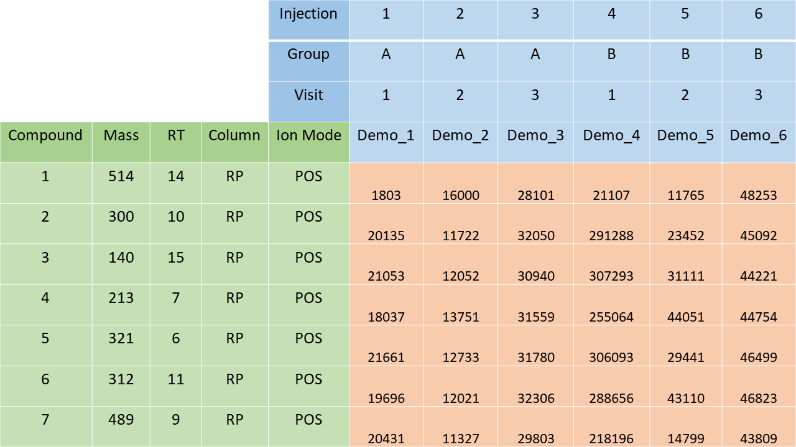

```{r setup, include = FALSE}
knitr::opts_chunk$set(
  collapse = TRUE,
  comment = "##"
)
# To improve runtime on Windows
BiocParallel::register(BiocParallel::SerialParam())
```

# Motivation
From the perspective of metabolites as the continuation of the central dogma of 
biology, metabolomics provides the closest link to many phenotypes of interest. 
This makes metabolomics research promising in teasing apart the complexities of 
living systems, attracting many new practitioners.

The notame R package was developed in parallel with a protocol 
article as a general guideline for data analysis in untargeted 
metabolomics studies [@notame]. The notame package was split into notame, 
notameViz and notameStats for Bioconductor. 
The primary goal is identifying quality, interesting features for 
laborious downstream steps relating to biological context, such as 
metabolite identification and pathway analysis. Bioconductor packages with 
complementary functionality in Bioconductor include pmp, phenomis and qmtools; 
notame packages brings partially overlapping and new functionality to the 
table. There are also Bioconductor packages for preprocessing, metabolite 
identification and pathway analysis. Together, notame, Bioconductor's 
dependency management and other Bioconductor functionality allow for quality, 
reproducible metabolomics research.  Please see the [notame website](https://
hanhineva-lab.github.io/notame/) and protocol article for more information 
[@notame].

# Installation
To install notame, install BiocManager first, if it is not installed. 
Afterwards use the install function from BiocManager.

```{r, eval = FALSE}
if (!requireNamespace("BiocManager", quietly = TRUE))
    install.packages("BiocManager")
BiocManager::install("notame")
library(notame)
```

## Drift correction 
Untargeted LC-MS metabolomics data usually suffers from signal intensity drift, 
i.e. systematic variation in the signal intensity as a function of injection 
order. Features of a dataset often have very different drift patterns. This 
means that to correct for the drift, we need a tool that can adapt to different 
drift patterns.

The approach used in this package models the drift separately for each feature, 
using pooled QC samples and cubic spline regression. The smoothing parameter 
controls the "wiggliness" of the function: the larger the smoothing parameter, 
the closer the spline is to a linear function. By default, the smoothing 
parameter is chosen automatically using cross validation, and can vary between 
0.5 and 1.5, where 1.5 is large enough to guarantee that the curve is 
practically linear. This interval seems to work well in practice.

We run the drift correction on log-transformed data. Log-transformed data 
follows the assumptions of the drift function model better, and avoids some 
practical issues. The corrected feature abundance for a sample with injection 
order $i$ is then computed using the following formula:
$$x_{corrected}(i) = x_{original}(i) + \overline{x}_{QC} - f_{drift}(i)$$

```{r}
library(notame)
data(toy_notame_set, package = "notame")
se <- toy_notame_set
names(assays(se)) <- "rawbundances"
# Mark missing values as NA
se <- mark_nas(se, value = 0)
# Correct drift
se <- correct_drift(se, name = "dc")
```

## Flagging low quality compounds
LC-MS metabolomics datasets contain a significant number of low-quality 
features. We use three established quality metrics based on pooled QC samples 
to flag those features: detection rate, relative standard deviation and 
dispersion ratio[@qcguidelines]. We are using the robust versions of relative 
standard deviation and dispersion ratio as they are less affected by a single 
outlying QC and since the original RSD works best if the data is normally 
distributed, which is often not the case with our data. In addition, one can 
use `flag_contaminants()` to, well, flag contaminants. 

By default, we use a slightly more lenient detection threshold, 0.5. The 
recommended limits for RSD and D-ratio are 0.2 and 0.4, respectively. Since we 
are using the robust alternatives, we have added an additional condition: 
signals with classic RSD, RSD\* and basic D-ratio all below 0.1 are kept. This 
additional condition prevents the removal of signals with very low values in 
all but a few samples. These signals tend to have a very high value of D-
ratio\*, since the median absolute deviation of the biological samples is not 
affected by the large concentration in a handful of samples, causing the D-
ratio* to overestimate the significance of random errors in measurements of QC 
samples. Thus, other quality metrics are applied, with a conservative limit of 
0.1 to ensure that only good quality signals are kept this way.

```{r}
se <- flag_detection(se, assay.type = "dc")
se <- flag_quality(se, assay.type = "dc")
head(rowData(se)$Flag)
```

Flagged features are not removed from the data, but the flag information is 
stored in the "Flag" column of `rowData(se)`. In notame, notameViz and 
notameStats packages, the flagged features are silently ignored in operations 
that involve muliple features at a time, including random forest imputation, 
PCA visualization and multivariate statistical models. For feature-wise 
statistics, the statistical model is fit for flagged features, but FDR 
correction is only done for non-flagged features. One can also set 
`all_features = TRUE` in these functions to include all features in the model.

## Imputation of missing values
LC-MS data often contain missing values. Note that even if some statistical 
methods state that they "can deal with missing values", they sometimes just 
ignore samples or variables with at least one missing value, or impute the 
missing values before applying the actual method. 

There are many different imputation strategies out there. We have tested a 
bunch of them on our data and we concluded that random forest imputation works 
best for our data [@kokla2019random]. To be brief, the method predicts the 
missing part of the data by fitting a random forest on the observed part of the 
data [@missForest]. The downside of random forest imputation is that it is 
rather slow. Thus, we recommend running the imputation separately for each 
analysis mode if the dataset has more than 100 samples, or if there are lots of 
missing values.

```{r}
set.seed(2025)
se <- impute_rf(se, assay.type = "dc", name = "imputed")
```

Simple imputation strategies included in `impute_simple()` are imputation by 
constant value, imputation by mean, median, minimum or half minimum value or by 
a small random value. Simple imputation strategies rely on the assumption that 
missingness is mostly caused by the fact that the metabolite concentration is 
below the detection limit.

## Utilities
Data can be read with `import_from_excel()`, which includes checks and 
preparation of metadata. To accommodate typical output from peak-picking 
software such as Agilent's MassHunter or MS-DIAL, the output is transformed 
into a spreadsheet for `import_from_excel()`. Alternatively, data in R can be 
wrangled and passed to the `SummarizedExperiment()` constructor.

```{r, echo = FALSE}
#| fig.cap = "Structure of spreadsheet for import_from_excel()."

```

General utilities include `combined_data()` for representing the instance in a
`data.frame` suitable for plotting and various functions for data wrangling. 
For keeping track of the analysis, notame offers a logging system operated 
using `init_log()`, `log_text()` and `finish_log()`. notame also keeps track 
of all the external packages used, offering you references for each. To see and 
log a list of references, use `citations()`.

Parallellization is used in many feature-wise calculations and is provided by 
the BiocParallel package. BiocParallel defaults to a parallel backend. For 
small-scale testing on Windows, it can be quicker to use serial execution:

```{r, eval = FALSE} 
BiocParallel::register(BiocParallel::SerialParam())
```

# Authors & Acknowledgements

The first version of notame was written by Anton Klåvus for his master's 
thesis in Bioinformatics at Aalto university (published under former name Anton 
Mattsson), while working for University of Eastern Finland and Afekta 
Technologies. The package is inspired by analysis scripts written by Jussi 
Paananen and Oskari Timonen. The algorithm for clustering molecular features 
originating from the same compound is based on MATLAB code written by David 
Broadhurst, Professor of Data Science & Biostatistics in the School of Science, 
and director of the Centre for Integrative Metabolomics & Computational Biology 
at the Edith Covan University.

If you find any bugs or other things to fix, please submit an issue on GitHub! 
All contributions to the package are always welcome!

# Session information

```{r, echo = FALSE}
sessionInfo()
```

# References