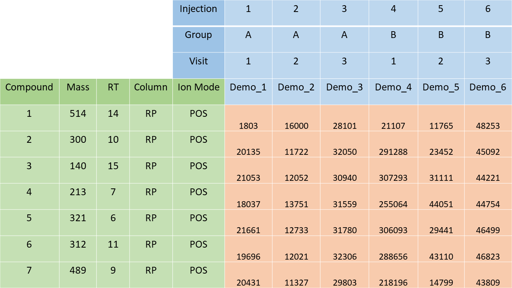

```{r setup, include = FALSE}
knitr::opts_chunk$set(
  collapse = TRUE,
  comment = "##"
)
```

# Motivation

From the perspective of metabolites as the continuation of the central dogma of 
biology, metabolomics provides the closest link to many phenotypes of interest. 
This makes metabolomics research promising in teasing apart the complexities of 
living systems, attracting many new practitioners. However, due to experimental 
reasons and the extensive data analysis, untargeted LC-MS metabolomics data 
analysis meets challenges with regard to quality and reproducibility.

In an effort to meet these challenges, the *notame* R package was developed in 
parallel with an associated protocol article published in the “Metabolomics 
Data Processing and Data Analysis—Current Best Practices” special issue of the 
Metabolites journal (Klåvus et al. 2020) [@notame]. The main outcome is 
identifying interesting features for laborious downstream steps relating to 
biological context, such as metabolite identification and pathway analysis, 
which fall outside the purview of *notame*. Bioconductor packages with 
complementary functionality in Bioconductor include pmp, phenomis and qmtools; 
*notame* brings partially overlapping and new functionality to the table. There 
are also Bioconductor packages for preprocessing, metabolite identification and 
pathway analysis, allowing for a fully programmatic workflow.

The streamlined *notame* experience, Bioconductor's dependency management and 
complementary Bioconductor functionality makes for a solid introduction to 
quality, reproducible metabolomics research.

# Installation
To install *notame*, install BiocManager first, if it is not installed. 
Afterwards use the install function from BiocManager.

```{r, eval = FALSE}
if (!requireNamespace("BiocManager", quietly = TRUE))
    install.packages("BiocManager")
BiocManager::install("notame")
library(notame)
```

# How it works
MetaboSet objects are the primary data structure of this package.
The functionality of *notame* can be broadly divided into data pretreatment and 
feature selection (Figure 1). Data pretreatment involves reducing unwanted
variation and data preparation dependent on downstream methods. The many 
visualizations used for inspecting the data pretreatment process also serve as 
exploratory data analysis. Feature selection aims to select a subset of 
interesting features across study groups before laborious steps relating to 
biological context. Please see the notame-package manual page for a complete 
description of functions, the Project Example vignette for usage and the 
associated protocol article for more information [@notame].

```{r, echo = FALSE}
#| fig.cap = "Overview of untargeted LC-MS metabolomics data analysis."
knitr::include_graphics("Overview.png")
```

## MetaboSet
MetaboSet is built upon the ExpressionSet class from the Biobase package by 
Bioconductor. In addition to basic ExpressionSet functionality, three slots and 
functions of the same names extend the MetaboSet class: group_col(), time_col() 
and subject_col(). They are used for accessing and setting names of columns 
with corresponding functionality and as default arguments in many functions.

Separate MetaboSet objects are created for each analytical mode using 
read_from_excel() and construct_metabosets(). This includes checks and 
preparation of the metadata to prepare the object for the analysis. To 
accommodate typical output from peak-picking software such as Agilent's 
MassHunter or MS-DIAL, the output is transformed into a spreadsheet for 
read_from_excel().

```{r, echo = FALSE}
#| fig.cap = "Structure of spreadsheet for read_from_excel()."

```

There are a few obligatory fields, including "Injection_order" in sample 
information, "Mass" or "Average mz" in feature data and "Retention time", 
"RetentionTime", "Average rt(min)" or "rt" in feature information (not case 
sensitive). There are further optional fields, including "Sample_ID" and "QC" 
in sample data as well as "Feature_ID" in feature data, which are automatically 
generated if unavailable. One or more fields in feature data can be used to 
split the data into parts, usually LC column x ionization mode, supplied as 
arguments to the `split_by` parameter. If the file only contains one mode, 
specify the name of the mode, e.g. "HILIC_pos" to the `name` parameter. 

## Data pretreatment
Data pretreatment functions return modified MetaboSet objects and are largely 
based on pooled QC samples [@qcguidelines]. Data pretreatment is generally 
performed separately for each mode. The visualizations used to monitor data 
pretreatment are saved to file by default, but can also be returned. The 
visualizations() wrapper can be used for saving visualizations at different 
stages of data pretreatment.

## Feature selection
Univariate statistics functions return a `data.frame`, to be manually 
filtered before inclusion into the feature data of the instance. Supervised 
learning functions return various data structures. 

Comprehensive results visualizations are returned and can be saved to file 
using save_plot(). Interesting features can be inspected with feature-wise 
visualizations which are saved to file by default but can be returned as a list.

## Utilities

General utilities include combined_data() for representing the instance in a
`data.frame` suitable for plotting, MakeSummarizedExperimentFromMetaboSet() 
for conversion to capitalize on the interoperability of Bioconductor and 
various functions for data wrangling. For keeping track of the analysis, 
*notame* offers a logging system operated using init_log(), log_text() and 
finish_log(). *notame* also keeps track of all the external packages used, 
offering you references for each. To see and log a list of references, use 
citations().

Parallellization is provided by the BiocParallel package. 
BiocParallel defaults to a parallel backend which can be changed using 
BiocParallel::register(). For a platform-agnostic choice, do:

```{r, eval = FALSE} 
BiocParallel::register(BiocParallel::DoparParam())
```

# Authors & Acknowledgements

The first version of *notame* was written by Anton Klåvus for his master's 
thesis in Bioinformatics at Aalto university (published under former name Anton 
Mattsson), while working for University of Eastern Finland and Afekta 
Technologies. The package is inspired by analysis scripts written by Jussi 
Paananen and Oskari Timonen. The algorithm for clustering molecular features 
originating from the same compound is based on MATLAB code written by David 
Broadhurst, Professor of Data Science & Biostatistics in the School of Science, 
and director of the Centre for Integrative Metabolomics & Computational Biology 
at the Edith Covan University.

If you find any bugs or other things to fix, please submit an issue on GitHub! 
All contributions to the package are always welcome!

# Session information

```{r, echo = FALSE}
sessionInfo()
```

# References